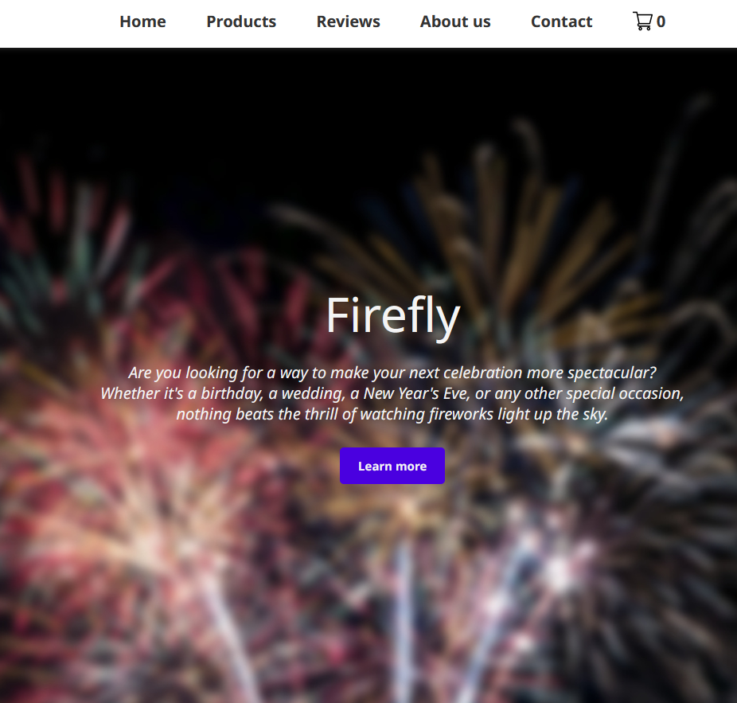
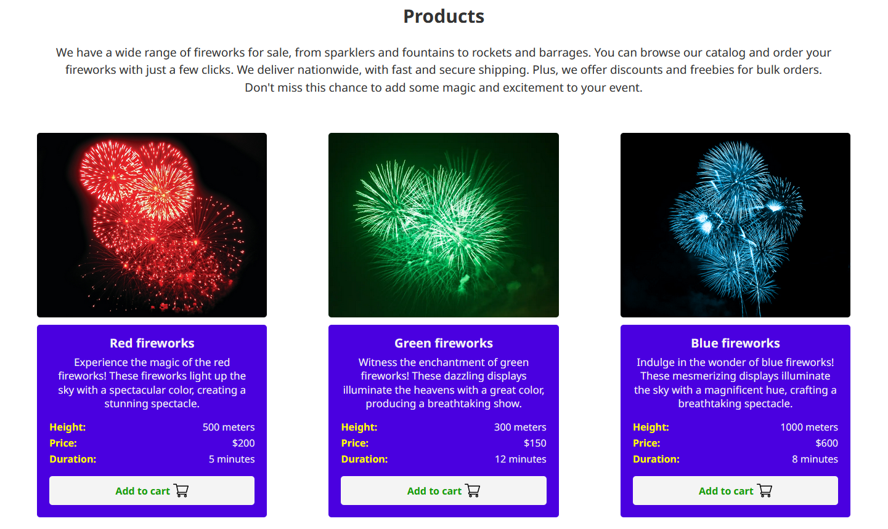
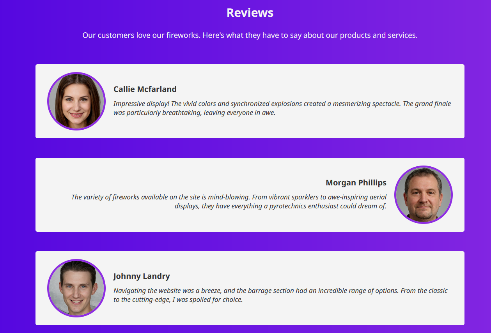

# Firefly
A clean and simple website for a small firework company. It features a robust design with a focus on the products, reviews and company values. The products are displayed in a grid layout and range from fireworks to sparklers, fountains and more.

***The mobile version is still in development.***

The website is hosted on GitHub Pages and can be accessed [here](https://sufferal.github.io/fireworks/). 

Live demo link: [sufferal.github.io/fireworks/](https://sufferal.github.io/fireworks/)

## Stack
* HTML
* CSS
* JavaScript

## Screenshots
### Home

### Products

### Reviews

## Credits 
* [thispersondoesnotexist.com](https://thispersondoesnotexist.com/) for the images of the people in the reviews.